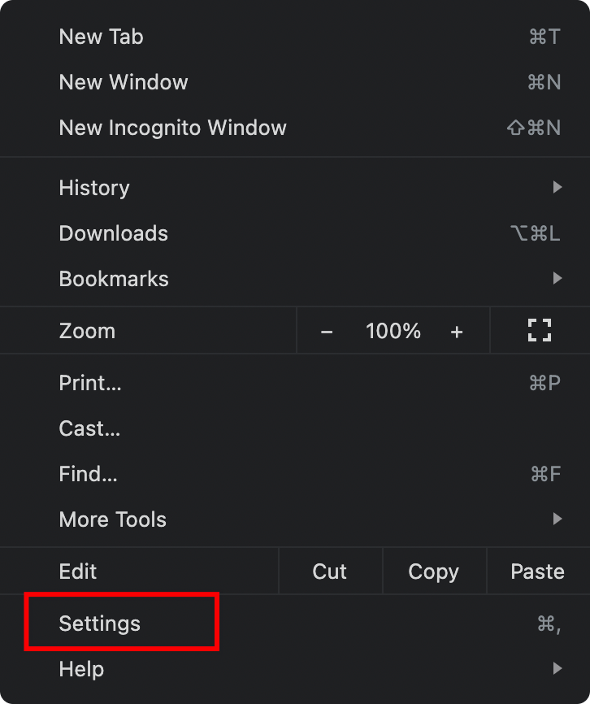
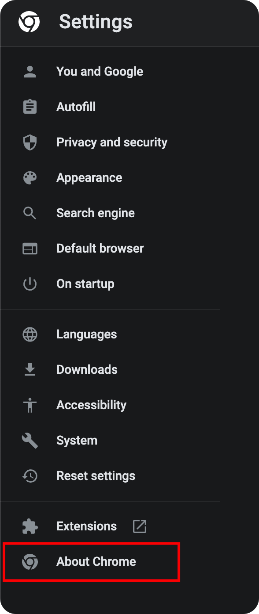
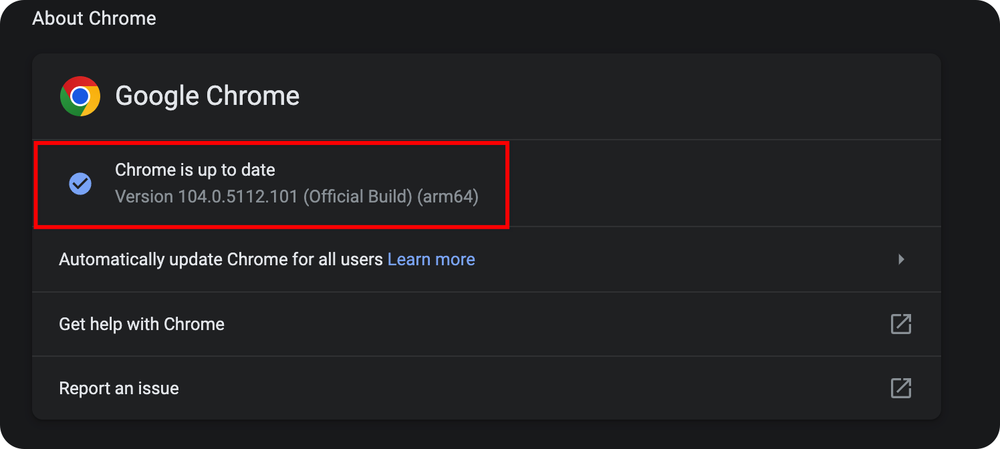
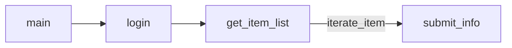

# AutoReport

> 基于Selenium实现的SHU每日一报脚本

## quick start

### 安装依赖

#### Python

船新版本：[Python 3.10.6](https://www.python.org/downloads/release/python-3106/)

#### Selenium

```sh
# 国内镜像
python -m pip install -i https://pypi.doubanio.com/simple selenium
# 国外服务器
python -m pip install selenium
```

#### WebDriver for Chrome

首先需要安装Chrome浏览器，然后[下载Chrome驱动](https://chromedriver.chromium.org/downloads)。在下载之前，需要检查自己的Chrome的浏览器版本，然后再选择对应的版本安装

<div align="center">
	
	
	
</div>

安装完之后，需要将下载好的压缩包解压，然后将可执行文件添加到系统环境变量中

### 配置data.json

> 程序不对本文件的正确性进行判断，所以请不要修改文件的格式，也不要将字段值设定在范围之外

根据所在地的不同，本文件的一些内容需要修改：

#### `in_Shanghai_index`

1. 如果在上海，且当日进过学校，请将本字段设置为1
	+ 根据当日所在的校区，设置`zone`
	+ 根据当日是否住校，设置`campus`
2. 如果在上海，但是当日没有进过学校，请将本字段设置为2
3. 如果不在上海，请将本字段设置为3

#### `is_home_address`

每日一报系统默认采用之前的数据填写结果作为默认地址，因此你需要对这个默认地址进行判断：是否是家庭地址。如果是家庭地址，那么请将本字段设置为1，否则请设置为2

### 运行程序

在运行程序之前，你需要检查自己是否填写过每日一报。意即，如果近一个月你都没有填写过每日一报，那么需要你先填写一天，然后再开始运行程序

```sh
python3 ./work.py
```

## 项目更新：

+ 1.1: 添加了命令行直接登录的方式：`python3 ./work.py <username> <password>`

## 项目结构



+ `login`函数负责登录，如果登录超时（10s）或者密码错误都会导致程序结束
+ `get_item_list`获取没有填写的每日一报，并且返回一个列表
+ `submit_info`填写数据并提交

## 存在的一些问题

在`login`函数中，用异常处理来判断密码是否正确，导致代码整个看起来非常抽象。但是也没有找到什么好的解决办法。
